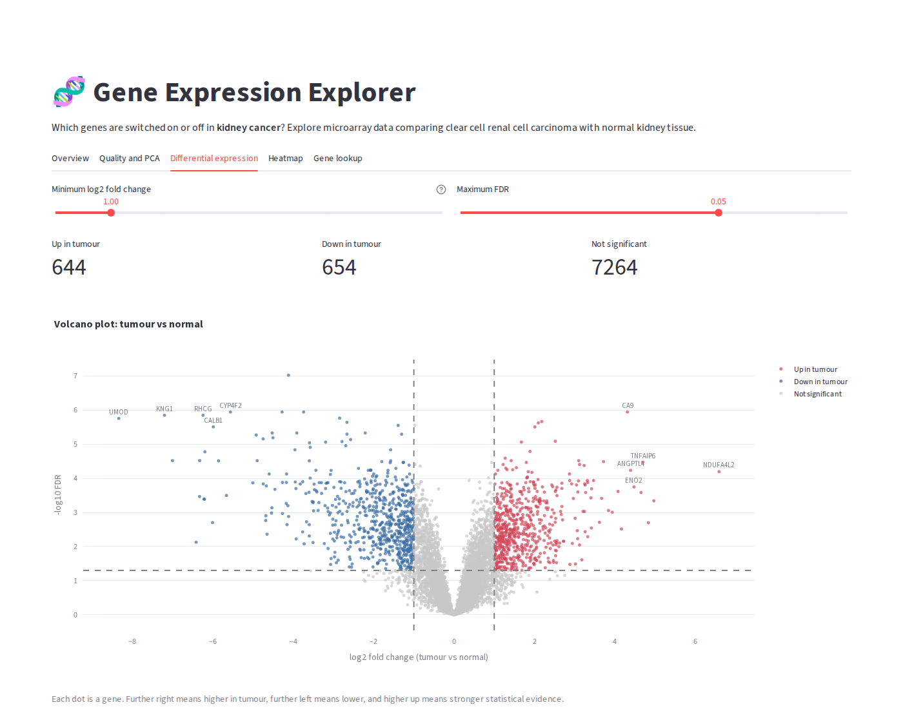

# 🧬 Gene Expression Explorer

An interactive web app for finding the genes that are switched on or off in kidney cancer, using public microarray data comparing tumour with normal kidney tissue.

   **Live app:** [Open the app](https://gene-expression-explorer-hk.streamlit.app/)



## Summary

Gene Expression Explorer analyses GEO dataset GSE781: 17 samples of clear cell renal cell carcinoma (ccRCC) and adjacent normal kidney tissue, measured across 8,562 genes. It checks sample quality, shows how samples cluster with PCA, finds differentially expressed genes with a volcano plot and adjustable cut-offs, displays the strongest genes in a heatmap, and lets you look up any gene with a short clinical note for well-known markers.

## Why this matters

ccRCC is the most common form of kidney cancer. Most tumours lose the *VHL* gene, which lets a protein called HIF build up and switch on the genes cells normally use when oxygen is low. That signature drives the heavy blood vessel growth seen in these tumours and is the reason drugs that block VEGF signalling are used to treat it. Seeing it emerge directly from the data is a good way to connect gene expression analysis to real clinical biology.

## Features

- **Overview:** study background, sample table with age, sex and tumour grade
- **Quality and PCA:** expression distributions per sample and a PCA plot
- **Differential expression:** volcano plot with adjustable fold change and FDR cut-offs, results table, CSV download
- **Heatmap:** top up- and down-regulated genes across all samples
- **Gene lookup:** expression of any gene by group, with matched patient samples linked

## Results

With a two-fold change cut-off and FDR below 5%, **644 genes are higher and 654 lower** in tumour than normal tissue. On PCA, the first component (56% of variance) separates every tumour from every normal sample.

Selected well-known genes:

| Up in tumour | Change | Down in tumour | Change |
|---|---|---|---|
| NDUFA4L2 | 97x | UMOD | 324x lower |
| ENO2 | 22x | KNG1 | 148x lower |
| ANGPTL4 | 21x | ALDOB | 85x lower |
| CA9 | 20x | SLC12A1 | 81x lower |
| HK2 | 13x | CALB1 | 64x lower |

The genes that go up are classic HIF targets (CA9, NDUFA4L2, ANGPTL4, VEGFA, EGLN3) and glycolysis genes (HK2, ENO2), matching the known biology of ccRCC. The genes that go down are markers of normal kidney function, such as uromodulin (UMOD) from the loop of Henle and aldolase B (ALDOB) from the proximal tubule. Together they show the tumour has lost its kidney identity and switched to a low-oxygen programme.

## Methods

1. **Data:** GEO series GSE781 (Lenburg et al., 2003), Affymetrix HG-U133A array, MAS5 signal values.
2. **Sample groups:** taken from each sample's tissue source. Three normal samples (N2, N3, N4) are mislabelled as carcinoma in their GEO titles, so titles were not used.
3. **Filtering:** probes kept if detected ("Present") in at least 3 samples, then log2 transformed.
4. **Gene mapping:** probes mapped to gene symbols. Where several probes measure one gene, the most highly expressed probe is kept.
5. **Differential expression:** Welch's t-test per gene, with Benjamini-Hochberg false discovery rate correction.
6. **PCA:** on the 1,000 most variable genes.

The processing is in [`scripts/prepare_data.py`](scripts/prepare_data.py) and the analysis in [`src/analysis.py`](src/analysis.py).

## Project structure

```
gene-expression-explorer/
├── app.py                  Streamlit app
├── src/
│   ├── analysis.py         loading, differential expression, PCA
│   └── plots.py            charts
├── scripts/
│   └── prepare_data.py     builds data/ from the raw GEO download
├── data/
│   ├── expression.csv.gz   log2 expression (genes x samples)
│   ├── samples.csv         sample information
│   └── genes.csv           gene names
├── docs/
│   └── screenshot.png
├── requirements.txt
├── LICENSE
└── README.md
```

## Run it locally

Requires Python 3.11.

```bash
git clone https://github.com/YOUR-USERNAME/gene-expression-explorer.git
cd gene-expression-explorer
python -m venv .venv
.venv\Scripts\activate          # on macOS or Linux: source .venv/bin/activate
pip install -r requirements.txt
streamlit run app.py
```

The processed data is included, so no download is needed. To rebuild it from GEO, run `pip install GEOparse` and then `python scripts/prepare_data.py`.

## Limitations

- **Small sample:** 9 tumour and 8 normal samples, so estimates for individual genes are uncertain.
- **Unpaired test:** 7 patients gave both a tumour and a normal sample. A paired analysis (or a method such as limma) would use this structure and be more powerful.
- **Older technology:** a 2003 microarray covering about half the genome after filtering. RNA sequencing would measure more genes more precisely.
- **Adjacent normal tissue:** normal samples come from the same kidneys as the tumours and may not be fully normal.
- **Expression only:** changes in expression show association, not cause, and are not validated at the protein level here.

## Data and citation

Lenburg ME, Liou LS, Gerry NP, Frampton GM, Cohen HT, Christman MF. *Previously unidentified changes in renal cell carcinoma gene expression identified by parametric analysis of microarray data.* BMC Cancer. 2003;3:31. GEO accession [GSE781](https://www.ncbi.nlm.nih.gov/geo/query/acc.cgi?acc=GSE781).

## Disclaimer

This project is for research and education only. It is not a diagnostic tool and must not be used to make decisions about any patient.

## Licence

Code released under the [MIT Licence](LICENSE). The data comes from the public GEO repository; please cite the original study when using it.
